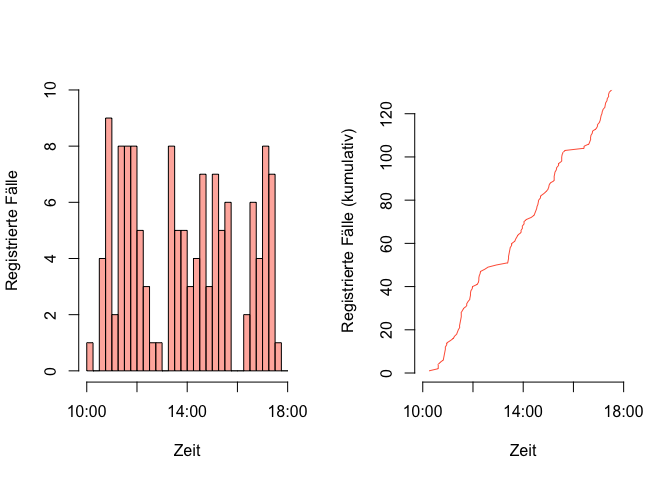
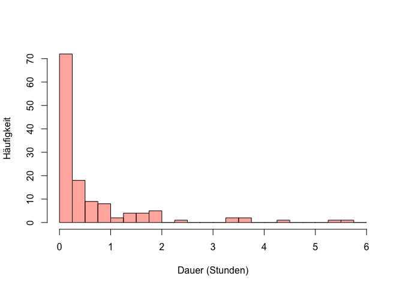
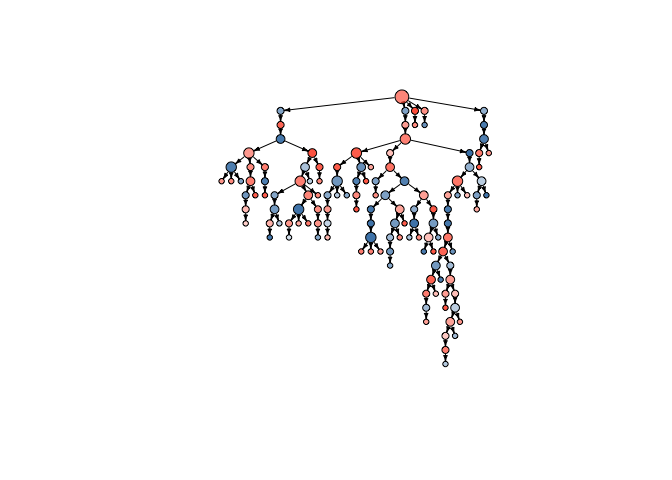
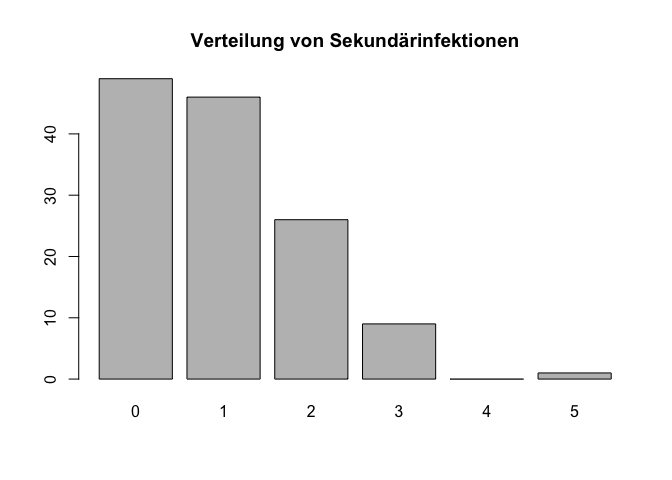
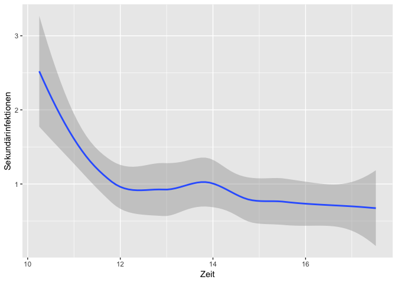
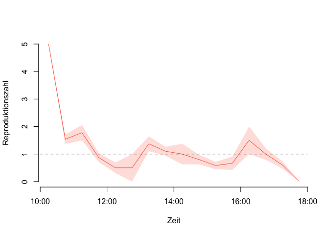
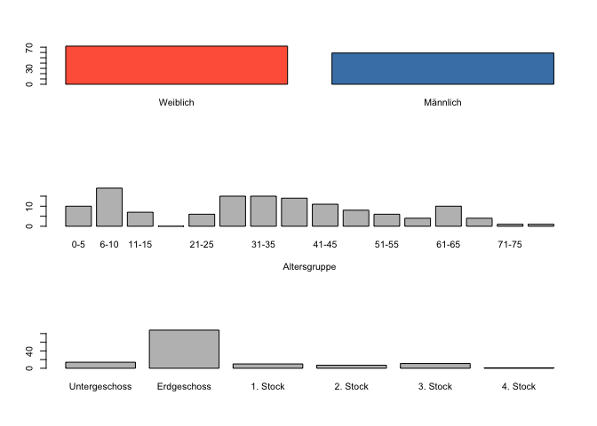
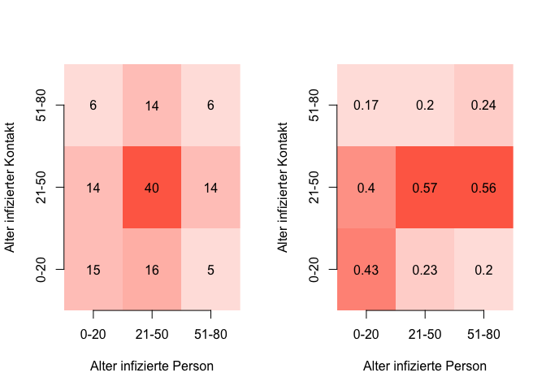

Pandemie-Spiel Offene Türe Mittelstrasse, Universität Bern
================
Michel Counotte, Julien Riou, Kaspar Meili, Maurane Riesen & Christian L. Althaus
1.  Oktober 2018

``` r
# Incidence of registered cases
par(mfrow=c(1,2))
hist(data$time,breaks=seq(10,18,0.25),xlim=c(10,18),ylim=c(0,10),col=alpha("tomato",alpha=0.5),xlab="Zeit",ylab="Registrierte Fälle",axes=FALSE,main=NA)
axis(1,seq(10,18,2),paste0(seq(10,18,2),":00"))
axis(2)

plot(data$time,1:n,xlim=c(10,18),ty="l",col="tomato",xlab="Zeit",ylab="Registrierte Fälle (kumulativ)",axes=FALSE,frame=FALSE)
axis(1,seq(10,18,2),paste0(seq(10,18,2),":00"))
axis(2)
```



``` r
# Generation time
gt <- numeric()
for(i in data$id) {
    gt <- c(gt,data$time[data$sid==i] - data$time[data$id==i])
}
gt[gt==0] <- 1/120

summary(gt)
```

    ##     Min.  1st Qu.   Median     Mean  3rd Qu.     Max. 
    ## 0.008333 0.050000 0.133333 0.614295 0.670833 5.750000

``` r
fit <- fitdist(gt,"gamma")
summary(fit)
```

    ## Fitting of the distribution ' gamma ' by maximum likelihood 
    ## Parameters : 
    ##        estimate Std. Error
    ## shape 0.5212229 0.05357602
    ## rate  0.8485176 0.13502818
    ## Loglikelihood:  -42.32984   AIC:  88.65969   BIC:  94.39475 
    ## Correlation matrix:
    ##           shape      rate
    ## shape 1.0000000 0.6459255
    ## rate  0.6459255 1.0000000

``` r
par(mfrow=c(1,1))
hist(gt,breaks=seq(0,6,0.25),xlim=c(0,6),col=alpha("tomato",alpha=0.5),xlab="Dauer (Stunden)",ylab="Häufigkeit",main=NA)
```



``` r
# Transmission network
edges <- cbind(data$sid,data$id)
edges <- edges[-1,]
g <- graph.data.frame(edges)

f_age <- function(x) {
    if(data$gender[data$id==x]==0) alpha("tomato",alpha=1-data$age[data$id==x]/100)
    else alpha("steelblue",alpha=1-data$age[data$id==x]/100)
}

f_time <- function(x) {
    if(data$gender[data$id==x]==0) alpha("tomato",alpha=(data$time[data$id==x]-data$time[1])/diff(range(data$time)))
    else alpha("steelblue",alpha=(data$time[data$id==x]-data$time[1])/diff(range(data$time)))
}

f_floor <- function(x) {
    if(data$gender[data$id==x]==0) alpha("tomato",alpha=(data$floor[data$id==x]+1)/5)
    else alpha("steelblue",alpha=(data$floor[data$id==x]+1)/5)
}

cols <- sapply(V(g),f_age)

plot(g,
    layout = layout.reingold.tilford,
    vertex.label = NA,
    vertex.size = 4 + 1.25*degree(g,mode = "out"), 
    edge.arrow.size = 0.3,
    edge.color = "black", 
    vertex.color = cols)
```



``` r
# Reproduction number
cases <- hist(data$sid[-1],breaks=seq(0.5,max(data$id)+0.5,1),plot=FALSE)$counts
x <- hist(cases,breaks=seq(-0.5,5.5,1),plot=FALSE)
barplot(x$counts,names.arg=0:5,main="Verteilung von Sekundärinfektionen")
```



``` r
r_data <- data.frame(time=data$time,cases=cases)
r_plot <- ggplot(r_data,aes(time,cases)) +
    geom_smooth() +
    labs(x="Zeit",y="Sekundärinfektionen")
r_plot
```

    ## `geom_smooth()` using method = 'loess' and formula 'y ~ x'



``` r
bins <- seq(10,18,0.5)
m <- numeric(length(bins[-1]))
c1 <- numeric(length(bins[-1]))
c2 <- numeric(length(bins[-1]))
for(i in 1:length(bins[-1])) {
    t1 <- bins[i]
    t2 <- bins[i+1]
    x <- r_data$cases[r_data$time > t1 & r_data$time < t2]
    if(length(x) > 1) {
        x <- t.test(x,conf.level=0.5)
        m[i] <- x$estimate
        c1[i] <- x$conf.int[1]
        c2[i] <- x$conf.int[2]
    } else {
        m[i] <- x
        c1[i] <- x
        c2[i] <- x
    }
}

tp <- bins[-length(bins)] + diff(bins)[1]/2
plot(tp,m,ty="l",col="tomato",xlab="Zeit",ylab="Reproduktionszahl",axes=FALSE,frame=FALSE)
polygon(c(tp,rev(tp)),c(c1,rev(c2)), col = alpha("tomato",alpha=0.2),border=NA)
lines(c(10,18),c(1,1),lty=2)
axis(1,seq(10,18,2),paste0(seq(10,18,2),":00"))
axis(2)
```



``` r
# Other distributions
par(mfrow=c(3,1))
x <- hist(data$gender,breaks=seq(-0.5,1.5,1),plot=FALSE)
barplot(x$counts,names.arg=c("Weiblich","Männlich"),col=c("tomato","steelblue"))
x <- hist(data$age,breaks=seq(0,80,5),plot=FALSE)
barplot(x$counts,names.arg=paste0(c(0,seq(6,76,5)),"-",seq(5,80,5)),xlab="Altersgruppe")
x <- hist(data$floor,breaks=seq(-1.5,4.5,1),plot=FALSE)
barplot(x$counts,names.arg=c("Untergeschoss","Erdgeschoss","1. Stock","2. Stock","3. Stock","4. Stock"))
```



``` r
# Age-mixing matrix
contacts <- data.frame()
for(i in data$id[-1]) {
    index <- data$sid[data$id==i]
    age <- data$age[data$id==index]
    contacts <- rbind(contacts,c(age,data$age[data$id==i]))
}
names(contacts) <- c("index","contact")

age <- c(-1,20,50,80)
n_age <- length(age)-1
mixing <- matrix(NA,nrow=n_age,ncol=n_age)
for(i in 1:n_age) {
    x <- contacts$contact[contacts$index > age[i] & contacts$index <= age[i+1]]
    x <- hist(x,breaks=age,plot=FALSE)$counts
    mixing[i,] <- x
}

par(mfrow=c(1,2))
image(1:n_age,1:n_age,mixing,col=alpha("tomato",alpha=seq(0.2,1,1/12)),xlab="Alter infizierte Person",ylab="Alter infizierter Kontakt",axes=FALSE)
axis(1,1:n_age,paste0(age[-(n_age+1)]+1,"-",age[-1]))
axis(2,1:n_age,paste0(age[-(n_age+1)]+1,"-",age[-1]))
for(i in 1:n_age) for (j in 1:n_age) text(i,j,signif(mixing[i,j],2))
image(1:n_age,1:n_age,mixing/rowSums(mixing),col=alpha("tomato",alpha=seq(0.2,1,1/12)),xlab="Alter infizierte Person",ylab="Alter infizierter Kontakt",axes=FALSE)
axis(1,1:n_age,paste0(age[-(n_age+1)]+1,"-",age[-1]))
axis(2,1:n_age,paste0(age[-(n_age+1)]+1,"-",age[-1]))
for(i in 1:n_age) for (j in 1:n_age) text(i,j,signif(mixing[i,j]/sum(mixing[i,]),2))
```


